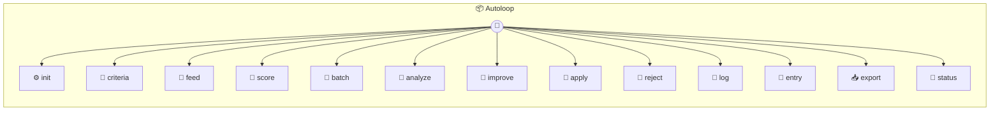

# Autoloop

AutoLoop — Self-Improving Optimization Loop Applies Karpathy's auto-research pattern to anything with a measurable output. Give it a file to optimize, binary eval criteria, and a way to measure results. It pulls real data, scores outputs, finds what works, rewrites the file, and logs every change. Each instance (`_use`) is a separate optimization target: `_use('video-hooks')` — optimize video script hooks `_use('email-subject')` — optimize email subject lines `_use('landing-cta')` — optimize landing page CTAs

> **13 tools** · API Photon · v1.0.0 · MIT

**Platform Features:** `stateful`

## ⚙️ Configuration

No configuration required.


## 📋 Quick Reference

| Method | Description |
|--------|-------------|
| `init` | Configure what to optimize |
| `criteria` | Set binary eval criteria — yes/no questions only, no vibes. |
| `feed` | Feed performance data — real-world metrics for past outputs. |
| `score` | Score a single output against all binary criteria. |
| `batch` | Batch-score multiple outputs at once |
| `analyze` | Analyze what's working — correlate eval scores with real performance. |
| `improve` | Generate an improved version of the target file. |
| `apply` | Apply the improved version to the target file |
| `reject` | Reject the pending improvement |
| `log` | View the research log — every iteration with its data and changes. |
| `entry` | View a specific iteration's full details |
| `export` | Export the full research log as JSON for handoff to a new model |
| `status` | Current state of the optimization loop |


## 🔧 Tools


### `init`

Configure what to optimize


| Parameter | Type | Required | Description |
|-----------|------|----------|-------------|
| `target` | any | Yes | Path to the file to improve (prompt, template, config) |
| `instructions` | string | Yes | What to optimize for — plain English |
| `metric` | string | Yes | Label for the real-world metric (e.g. `views`) |


---


### `criteria`

Set binary eval criteria — yes/no questions only, no vibes. Each criterion must be a clear yes/no question that an LLM can answer without subjectivity. "Is this engaging?" is bad. "Does the hook describe a result or transformation, not just a feature?" is good.


| Parameter | Type | Required | Description |
|-----------|------|----------|-------------|
| `criteria` | any | Yes | Array of { question, label } objects |


---


### `feed`

Feed performance data — real-world metrics for past outputs. Each data point is an output that was produced and its real performance. The loop learns from what worked and what didn't.


| Parameter | Type | Required | Description |
|-----------|------|----------|-------------|
| `points` | any | Yes | Array of { id, content, metric, date, meta? } |


---


### `score`

Score a single output against all binary criteria. Returns the score breakdown. In production, an LLM answers each yes/no question. Here you provide the answers directly so the loop stays model-agnostic.


| Parameter | Type | Required | Description |
|-----------|------|----------|-------------|
| `id` | any | Yes | Data point ID to score |
| `answers` | Record<string | Yes | Object mapping criterion labels to true/false |


---


### `batch`

Batch-score multiple outputs at once


| Parameter | Type | Required | Description |
|-----------|------|----------|-------------|
| `scores` | any | Yes | Array of { id, answers } objects |


---


### `analyze`

Analyze what's working — correlate eval scores with real performance. Finds winners (high eval + high metric), losers, and false positives (high eval + low metric, meaning the eval criteria need fixing).


---


### `improve`

Generate an improved version of the target file. Based on the analysis, provides a diff of recommended changes. The changes are NOT applied automatically — review first with `apply`.


| Parameter | Type | Required | Description |
|-----------|------|----------|-------------|
| `changes` | any | Yes | Description of what to change and why |


---


### `apply`

Apply the improved version to the target file


| Parameter | Type | Required | Description |
|-----------|------|----------|-------------|
| `content` | any | Yes | The new file content to write |


---


### `reject`

Reject the pending improvement


---


### `log`

View the research log — every iteration with its data and changes. The research log is the most valuable asset. When a smarter model comes out, hand it this log and it picks up exactly where you left off.


---


### `entry`

View a specific iteration's full details


| Parameter | Type | Required | Description |
|-----------|------|----------|-------------|
| `iteration` | any | Yes | Iteration number to view |


---


### `export`

Export the full research log as JSON for handoff to a new model


---


### `status`

Current state of the optimization loop


---


## 🏗️ Architecture




## 📥 Usage

```bash
# Install from marketplace
photon add autoloop

# Get MCP config for your client
photon info autoloop --mcp
```

## 📦 Dependencies

No external dependencies.

---

MIT · v1.0.0
