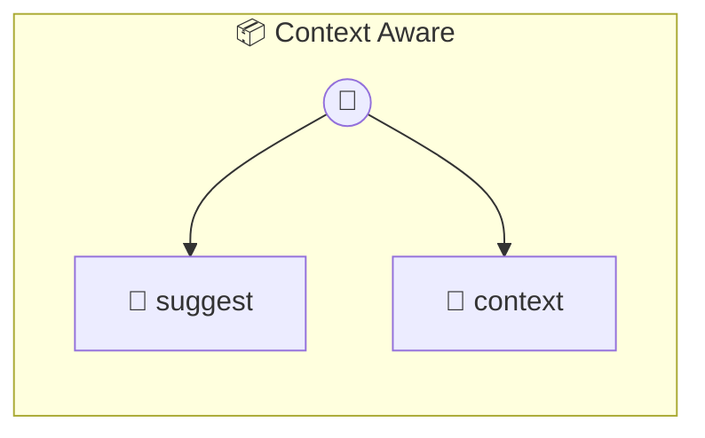

# Context Aware

Context-Aware Photon Demonstrates bidirectional state exposure where frontend widget state flows into photon methods via this._clientState.

> **2 tools** · API Photon · v1.0.0 · MIT


## ⚙️ Configuration

No configuration required.


## 🔧 Tools


### `suggest`

Suggest items based on frontend widget state. The bridge auto-injects widgetState as _clientState in tool args. The loader extracts it onto this._clientState before method execution.


| Parameter | Type | Required | Description |
|-----------|------|----------|-------------|
| `query` | string | Yes | Search query from the user |


---


### `context`

Return the full client state for debugging. Useful for verifying what the frontend is sending.


---


## 🏗️ Architecture




## 📥 Usage

```bash
# Install from marketplace
photon add context-aware

# Get MCP config for your client
photon info context-aware --mcp
```

## 📦 Dependencies

No external dependencies.

---

MIT · v1.0.0
