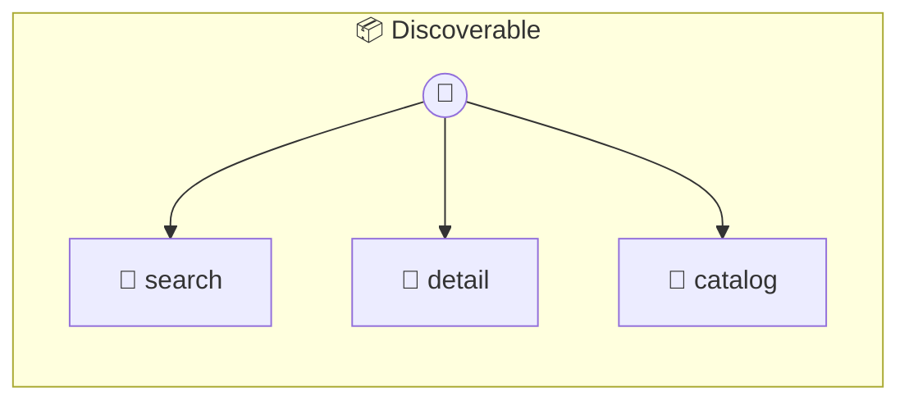

# Discovery Demo

Discoverable Service Demonstrates Server Cards and A2A Agent Cards. Both card types are auto-generated from the same photon metadata — rich docblocks, @stateful tag, and method descriptions map directly to MCP Server Card tools and A2A Agent Card skills.

> **3 tools** · API Photon · v2.0.0 · MIT

**Platform Features:** `stateful`

## ⚙️ Configuration

No configuration required.


## 🔧 Tools


### `search`

Search the knowledge base for topics. Returns matching entries from the indexed knowledge base. Supports partial matching on language names.


| Parameter | Type | Required | Description |
|-----------|------|----------|-------------|
| `query` | string | Yes | Search term |


---


### `detail`

Get detailed information about a specific topic. Returns structured data about a programming concept.


| Parameter | Type | Required | Description |
|-----------|------|----------|-------------|
| `language` | string | Yes | Programming language |
| `topic` | string | Yes | Specific topic to look up |


---


### `catalog`

List all available languages and topic counts. Provides a summary of what's in the knowledge base.


---


## 🏗️ Architecture




## 📥 Usage

```bash
# Install from marketplace
photon add discoverable

# Get MCP config for your client
photon info discoverable --mcp
```

## 📦 Dependencies

No external dependencies.

---

MIT · v2.0.0
