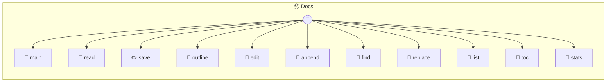

# Docs

Docs — Markdown Document Editor with PDF Export A document editor backed by plain markdown files with YAML frontmatter. Each instance is a document: `_use('quarterly-report')` → `quarterly-report.md`. Pass a full path to open any file: `_use('/path/to/doc.md')`. Features page-aware preview via Paged.js, TOC generation, footnotes, custom containers (note/warning/tip), multi-column layouts, and PDF export.

> **11 tools** · API Photon · v1.0.0 · MIT

**Platform Features:** `custom-ui` `stateful`

## ⚙️ Configuration

No configuration required.


## 📋 Quick Reference

| Method | Description |
|--------|-------------|
| `main` | Open the document editor UI |
| `read` | Read the document markdown |
| `save` | Save the full document markdown |
| `outline` | Get the document's heading structure for navigation |
| `edit` | Edit a specific section by heading path |
| `append` | Append content at the end of the document or after a specific section |
| `find` | Find text in the document with optional fuzzy matching |
| `replace` | Find and replace text in the document |
| `list` | List saved documents in the docs folder |
| `toc` | Generate table of contents from the document structure |
| `stats` | Document statistics: word count, reading time, section breakdown |


## 🔧 Tools


### `main`

Open the document editor UI


---


### `read`

Read the document markdown


---


### `save`

Save the full document markdown


| Parameter | Type | Required | Description |
|-----------|------|----------|-------------|
| `markdown` | any | Yes | Full markdown content with YAML frontmatter |


---


### `outline`

Get the document's heading structure for navigation


---


### `edit`

Edit a specific section by heading path


| Parameter | Type | Required | Description |
|-----------|------|----------|-------------|
| `section` | any | Yes | Heading text or path like "Chapter 3/Introduction" |
| `markdown` | string } | Yes | New content for that section (everything under the heading until next same-level heading) |


---


### `append`

Append content at the end of the document or after a specific section


| Parameter | Type | Required | Description |
|-----------|------|----------|-------------|
| `markdown` | any | Yes | Content to append |
| `after` | string } | No | Optional heading text — inserts after that section instead of end |


---


### `find`

Find text in the document with optional fuzzy matching


| Parameter | Type | Required | Description |
|-----------|------|----------|-------------|
| `query` | any | Yes | Search text |
| `fuzzy` | boolean | No | Enable fuzzy matching {@default false} |
| `scope` | string } | No | Limit search to a section heading |


---


### `replace`

Find and replace text in the document


| Parameter | Type | Required | Description |
|-----------|------|----------|-------------|
| `pattern` | any | Yes | Text to find (string or regex pattern) |
| `replacement` | string | Yes | Replacement text |
| `scope` | string | No | Limit to a section heading |
| `all` | boolean | No | Replace all occurrences {@default true} |


---


### `list`

List saved documents in the docs folder


---


### `toc`

Generate table of contents from the document structure


---


### `stats`

Document statistics: word count, reading time, section breakdown


---


## 🏗️ Architecture




## 📥 Usage

```bash
# Install from marketplace
photon add docs

# Get MCP config for your client
photon info docs --mcp
```

## 📦 Dependencies

No external dependencies.

---

MIT · v1.0.0
