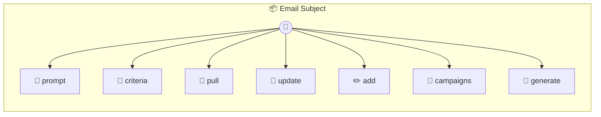

# Email Subject

Email Subject — AutoResearch target for email subject lines Implements the AutoResearch interface so autorun can optimize your email subject lines based on real open rates. Stores the template and pulls metrics from a CSV log.

> **7 tools** · API Photon · v1.0.0 · MIT

**Platform Features:** `stateful`

## ⚙️ Configuration

No configuration required.


## 📋 Quick Reference

| Method | Description |
|--------|-------------|
| `prompt` | Returns the current subject line template |
| `criteria` | Binary eval criteria for subject line quality |
| `pull` | Pull performance data from the metrics CSV |
| `update` | Write an improved subject line template |
| `add` | Log an email campaign's subject line and open rate |
| `campaigns` | View all tracked campaigns |
| `generate` | Generate subject line variants using the current template |


## 🔧 Tools


### `prompt`

Returns the current subject line template


---


### `criteria`

Binary eval criteria for subject line quality


---


### `pull`

Pull performance data from the metrics CSV


---


### `update`

Write an improved subject line template


---


### `add`

Log an email campaign's subject line and open rate


| Parameter | Type | Required | Description |
|-----------|------|----------|-------------|
| `id` | any | Yes | Campaign identifier (e.g. `campaign-42`) |
| `subject` | string | Yes | The subject line used |
| `openRate` | number | Yes | Open rate as percentage (e.g. `24.5`) |
| `sent` | number | Yes | Number of emails sent (e.g. `5000`) |


---


### `campaigns`

View all tracked campaigns


---


### `generate`

Generate subject line variants using the current template


| Parameter | Type | Required | Description |
|-----------|------|----------|-------------|
| `topic` | any | Yes | Email topic/content summary |
| `count` | number } | No | How many variants to generate (e.g. `5`) |


---


## 🏗️ Architecture




## 📥 Usage

```bash
# Install from marketplace
photon add email-subject

# Get MCP config for your client
photon info email-subject --mcp
```

## 📦 Dependencies

No external dependencies.

---

MIT · v1.0.0
