# Gbp Manager

GBP Manager — Google Business Profile Optimization for Local Services Automated Google Business Profile management that finds local service businesses with weak profiles, audits them, responds to reviews, generates posts, and delivers monthly performance reports. Each instance (`_use`) is one client business: `_use('ace-plumbing')` `_use('cool-air-hvac')` `_use('summit-roofing')`

> **19 tools** · API Photon · v1.0.0 · MIT

**Platform Features:** `stateful`

## ⚙️ Configuration

No configuration required.


## 📋 Quick Reference

| Method | Description |
|--------|-------------|
| `prospect` | Find local service businesses with weak Google profiles. |
| `pitch` | Generate a pitch email for a prospective client. |
| `onboard` | Onboard a new client — set up their business profile. |
| `tier` | Set the service tier for this client |
| `audit` | Run a full Google Business Profile audit. |
| `audits` | View audit history showing improvement over time |
| `reviews` | Import reviews from the Google Business Profile. |
| `unanswered` | Get unanswered reviews that need responses. |
| `respond` | Draft a response to a review using the response template. |
| `replied` | Save a review response (after the LLM drafts it) |
| `draft` | Draft a weekly Google Business Profile post. |
| `post` | Save a drafted post |
| `published` | Mark a post as published |
| `history` | View post history |
| `competitors` | Record competitor snapshots for comparison. |
| `report` | Generate a monthly performance report. |
| `responses` | Update the review response template. |
| `posts` | Update the weekly post template. |
| `status` | Client dashboard — overview of all activity |


## 🔧 Tools


### `prospect`

Find local service businesses with weak Google profiles. Use agent-browser to search Google Maps for a trade in a city. Returns businesses sorted by opportunity (low reviews, low rating, no recent posts = high opportunity). Example: `agent-browser open "https://google.com/maps/search/plumber+in+Austin+TX"` `agent-browser snapshot -i` → click each listing → extract details


| Parameter | Type | Required | Description |
|-----------|------|----------|-------------|
| `trade` | any | Yes | Service trade to search for (e.g. `plumber`) |
| `city` | string | Yes | City and state (e.g. `Austin TX`) |
| `results` | any | Yes | Array of business profiles found |


---


### `pitch`

Generate a pitch email for a prospective client. Creates a personalized pitch showing their profile weaknesses vs competitors, with a clear value proposition.


| Parameter | Type | Required | Description |
|-----------|------|----------|-------------|
| `name` | any | Yes | Business name |
| `email` | string | Yes | Business email |
| `rating` | number | Yes | Their current Google rating |
| `reviewCount` | number | Yes | Their review count |
| `topCompetitor` | string | Yes | Competitor name with better profile |
| `competitorRating` | number | Yes | Competitor's rating |
| `competitorReviews` | number | Yes | Competitor's review count |


---


### `onboard`

Onboard a new client — set up their business profile. Store the client's business details. This is the starting point for all management — reviews, posts, audits, and reports reference this profile.


| Parameter | Type | Required | Description |
|-----------|------|----------|-------------|
| `profile` | any | Yes | Business profile details |


---


### `tier`

Set the service tier for this client


| Parameter | Type | Required | Description |
|-----------|------|----------|-------------|
| `tier` | any | Yes | Service tier [format: segmented] |


---


### `audit`

Run a full Google Business Profile audit. Scores the profile across 10 areas and provides specific fixes. Use agent-browser to visit their Google Maps listing and assess each area. Areas scored: - Star rating (vs 4.5 benchmark) - Review count (vs 50 benchmark) - Review response rate (vs 100% target) - Response speed (within 24h) - Post frequency (weekly target) - Photo count and quality - Business info completeness (hours, services, description) - Q&A section activity - Category accuracy - Competitor positioning


| Parameter | Type | Required | Description |
|-----------|------|----------|-------------|
| `findings` | any | Yes | Array of audit findings from the assessment |


---


### `audits`

View audit history showing improvement over time


---


### `reviews`

Import reviews from the Google Business Profile. Use agent-browser to visit the Maps listing, click "Reviews", sort by newest, and extract each review's author, rating, text, date, and whether it has a response.


| Parameter | Type | Required | Description |
|-----------|------|----------|-------------|
| `reviews` | any | Yes | Array of reviews to import |


---


### `unanswered`

Get unanswered reviews that need responses. Returns reviews sorted by priority: negative first (damage control), then by date (newest first).


---


### `respond`

Draft a response to a review using the response template. Returns the template guidelines and review details so the LLM can craft a personalized response following the proven patterns.


| Parameter | Type | Required | Description |
|-----------|------|----------|-------------|
| `id` | any | Yes | Review ID to respond to |


---


### `replied`

Save a review response (after the LLM drafts it)


| Parameter | Type | Required | Description |
|-----------|------|----------|-------------|
| `id` | any | Yes | Review ID |
| `response` | string } | Yes | The response text to save |


---


### `draft`

Draft a weekly Google Business Profile post. Returns the post template and business context so the LLM can generate relevant, engaging content. Rotates through post types automatically.


| Parameter | Type | Required | Description |
|-----------|------|----------|-------------|
| `type` | any | Yes | Post type [format: segmented] |


---


### `post`

Save a drafted post


| Parameter | Type | Required | Description |
|-----------|------|----------|-------------|
| `content` | any | Yes | Post text content |
| `type` | 'update' | 'offer' | 'event' | 'tip' } | No | Post type |


---


### `published`

Mark a post as published


| Parameter | Type | Required | Description |
|-----------|------|----------|-------------|
| `id` | any | Yes | Post ID |


---


### `history`

View post history


---


### `competitors`

Record competitor snapshots for comparison. Use agent-browser to check competitor Google profiles and record their current rating and review count.


| Parameter | Type | Required | Description |
|-----------|------|----------|-------------|
| `competitors` | any | Yes | Array of competitor snapshots |


---


### `report`

Generate a monthly performance report. Compiles all activity from the past month: reviews received and responded to, rating changes, posts published, competitor comparison, and recommendations for next month. Send to client via `gws gmail +send` with the report attached.


| Parameter | Type | Required | Description |
|-----------|------|----------|-------------|
| `month` | any | Yes | Month label (e.g. `March 2026`) |
| `highlights` | string[] | Yes | Key wins this month |
| `recommendations` | string[] | Yes | Suggestions for next month |


---


### `responses`

Update the review response template. This template guides the LLM when drafting review responses. Autoloop can optimize this based on which response styles lead to updated ratings or "helpful" votes.


| Parameter | Type | Required | Description |
|-----------|------|----------|-------------|
| `template` | any | Yes | New response template content |


---


### `posts`

Update the weekly post template. This template guides the LLM when drafting GBP posts. Autoloop can optimize based on post engagement metrics.


| Parameter | Type | Required | Description |
|-----------|------|----------|-------------|
| `template` | any | Yes | New post template content |


---


### `status`

Client dashboard — overview of all activity


---


## 🏗️ Architecture

```mermaid
flowchart LR
    subgraph gbp_manager["📦 Gbp Manager"]
        direction TB
        PHOTON((🎯))
        T0[🔧 prospect]
        PHOTON --> T0
        T1[🔧 pitch]
        PHOTON --> T1
        T2[🔧 onboard]
        PHOTON --> T2
        T3[🔧 tier]
        PHOTON --> T3
        T4[🔧 audit]
        PHOTON --> T4
        T5[🔧 audits]
        PHOTON --> T5
        T6[🔧 reviews]
        PHOTON --> T6
        T7[🔧 unanswered]
        PHOTON --> T7
        T8[🔧 respond]
        PHOTON --> T8
        T9[🔧 replied]
        PHOTON --> T9
        T10[🔧 draft]
        PHOTON --> T10
        T11[📤 post]
        PHOTON --> T11
        T12[📤 published]
        PHOTON --> T12
        T13[🔧 history]
        PHOTON --> T13
        T14[🔧 competitors]
        PHOTON --> T14
        T15[🔧 report]
        PHOTON --> T15
        T16[🔧 responses]
        PHOTON --> T16
        T17[📤 posts]
        PHOTON --> T17
        T18[🔧 status]
        PHOTON --> T18
    end
```




## 📥 Usage

```bash
# Install from marketplace
photon add gbp-manager

# Get MCP config for your client
photon info gbp-manager --mcp
```

## 📦 Dependencies

No external dependencies.

---

MIT · v1.0.0
