# Input Showcase

Input Showcase Demonstrates all input format types in the Photon auto-UI. Each method showcases a different input widget.

> **22 tools** · API Photon · v1.0.0 · MIT


## ⚙️ Configuration

No configuration required.


## 📋 Quick Reference

| Method | Description |
|--------|-------------|
| `text` | Basic text input (default) |
| `email` | Email input with validation |
| `secret` | Password input with show/hide toggle |
| `website` | URL input with open-link button |
| `phone` | Phone number input |
| `color` | Color picker with hex input |
| `search` | Search input |
| `date` | Date picker with calendar |
| `birthday` | Smart date: birthday opens year view ~25 years ago |
| `datetime` | Date-time picker with calendar + time |
| `daterange` | Date range with two date pickers |
| `tags` | Tag/chip input |
| `rate` | Star rating (1-5) |
| `segment` | Segmented control for enum |
| `radio` | Radio buttons for enum |
| `code` | Code editor with line numbers |
| `markdown` | Markdown editor with live preview |
| `slider` | Slider (number with min + max) |
| `toggle` | Boolean toggle |
| `dropdown` | Enum dropdown (default for enums) |
| `filepick` | File picker |
| `textarea` | Textarea (auto-detected from key name) |


## 🔧 Tools


### `text`

Basic text input (default)


| Parameter | Type | Required | Description |
|-----------|------|----------|-------------|
| `name` | any | Yes | Your full name |


---


### `email`

Email input with validation


| Parameter | Type | Required | Description |
|-----------|------|----------|-------------|
| `email` | any | Yes | Your email address [format: email] |


---


### `secret`

Password input with show/hide toggle


| Parameter | Type | Required | Description |
|-----------|------|----------|-------------|
| `password` | any | Yes | Your secret [format: password] |


---


### `website`

URL input with open-link button


| Parameter | Type | Required | Description |
|-----------|------|----------|-------------|
| `url` | any | Yes | Website URL [format: url] |


---


### `phone`

Phone number input


| Parameter | Type | Required | Description |
|-----------|------|----------|-------------|
| `phone` | any | Yes | Contact number [format: phone] |


---


### `color`

Color picker with hex input


| Parameter | Type | Required | Description |
|-----------|------|----------|-------------|
| `color` | any | Yes | Theme color [format: color] |


---


### `search`

Search input


| Parameter | Type | Required | Description |
|-----------|------|----------|-------------|
| `query` | any | Yes | Search term [format: search] |


---


### `date`

Date picker with calendar


| Parameter | Type | Required | Description |
|-----------|------|----------|-------------|
| `date` | any | Yes | Select a date [format: date] |


---


### `birthday`

Smart date: birthday opens year view ~25 years ago


| Parameter | Type | Required | Description |
|-----------|------|----------|-------------|
| `birthday` | any | Yes | Your date of birth [format: date] |


---


### `datetime`

Date-time picker with calendar + time


| Parameter | Type | Required | Description |
|-----------|------|----------|-------------|
| `datetime` | any | Yes | Event date and time [format: date-time] |


---


### `daterange`

Date range with two date pickers


| Parameter | Type | Required | Description |
|-----------|------|----------|-------------|
| `range` | any | Yes | Period [format: date-range] |


---


### `tags`

Tag/chip input


| Parameter | Type | Required | Description |
|-----------|------|----------|-------------|
| `tags` | any | Yes | Labels for the item [format: tags] |


---


### `rate`

Star rating (1-5)


| Parameter | Type | Required | Description |
|-----------|------|----------|-------------|
| `rating` | any | Yes | Your rating [format: rating] |


---


### `segment`

Segmented control for enum


| Parameter | Type | Required | Description |
|-----------|------|----------|-------------|
| `size` | any | Yes | T-shirt size [format: segmented] |


---


### `radio`

Radio buttons for enum


| Parameter | Type | Required | Description |
|-----------|------|----------|-------------|
| `priority` | any | Yes | Task priority [format: radio] |


---


### `code`

Code editor with line numbers


| Parameter | Type | Required | Description |
|-----------|------|----------|-------------|
| `code` | any | Yes | TypeScript snippet {@format code:typescript} |


---


### `markdown`

Markdown editor with live preview


| Parameter | Type | Required | Description |
|-----------|------|----------|-------------|
| `notes` | any | Yes | Write some notes [format: markdown] |


---


### `slider`

Slider (number with min + max)


| Parameter | Type | Required | Description |
|-----------|------|----------|-------------|
| `volume` | any | Yes | Volume level [min: 0, max: 100] |


---


### `toggle`

Boolean toggle


| Parameter | Type | Required | Description |
|-----------|------|----------|-------------|
| `enabled` | any | Yes | Feature flag |


---


### `dropdown`

Enum dropdown (default for enums)


| Parameter | Type | Required | Description |
|-----------|------|----------|-------------|
| `country` | any | Yes | Select country |


---


### `filepick`

File picker


| Parameter | Type | Required | Description |
|-----------|------|----------|-------------|
| `file` | any | Yes | Select a file [format: file] |


---


### `textarea`

Textarea (auto-detected from key name)


| Parameter | Type | Required | Description |
|-----------|------|----------|-------------|
| `content` | any | Yes | Your content |


---


## 🏗️ Architecture

```mermaid
flowchart LR
    subgraph input_showcase["📦 Input Showcase"]
        direction TB
        PHOTON((🎯))
        T0[🔧 text]
        PHOTON --> T0
        T1[🔧 email]
        PHOTON --> T1
        T2[🔧 secret]
        PHOTON --> T2
        T3[🔧 website]
        PHOTON --> T3
        T4[🔧 phone]
        PHOTON --> T4
        T5[🔧 color]
        PHOTON --> T5
        T6[📖 search]
        PHOTON --> T6
        T7[🔧 date]
        PHOTON --> T7
        T8[🔧 birthday]
        PHOTON --> T8
        T9[🔧 datetime]
        PHOTON --> T9
        T10[🔧 daterange]
        PHOTON --> T10
        T11[🔧 tags]
        PHOTON --> T11
        T12[🔧 rate]
        PHOTON --> T12
        T13[🔧 segment]
        PHOTON --> T13
        T14[🔧 radio]
        PHOTON --> T14
        T15[🔧 code]
        PHOTON --> T15
        T16[🔧 markdown]
        PHOTON --> T16
        T17[🔧 slider]
        PHOTON --> T17
        T18[🔧 toggle]
        PHOTON --> T18
        T19[🗑️ dropdown]
        PHOTON --> T19
        T20[🔧 filepick]
        PHOTON --> T20
        T21[🔧 textarea]
        PHOTON --> T21
    end
```




## 📥 Usage

```bash
# Install from marketplace
photon add input-showcase

# Get MCP config for your client
photon info input-showcase --mcp
```

## 📦 Dependencies

No external dependencies.

---

MIT · v1.0.0
