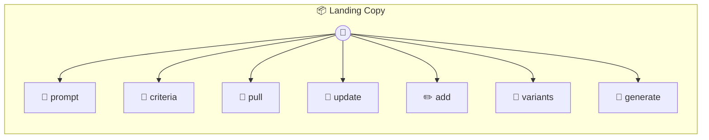

# Landing Copy

Landing Copy — AutoResearch target for landing page copy Implements the AutoResearch interface so autorun can optimize your landing page hero copy based on conversion rates. Stores variants and tracks which ones convert.

> **7 tools** · API Photon · v1.0.0 · MIT

**Platform Features:** `stateful`

## ⚙️ Configuration

No configuration required.


## 📋 Quick Reference

| Method | Description |
|--------|-------------|
| `prompt` | Returns the current landing page copy template |
| `criteria` | Binary eval criteria for landing page copy |
| `pull` | Pull conversion data from the metrics CSV |
| `update` | Write an improved copy template |
| `add` | Log a landing page variant and its conversion rate |
| `variants` | View all tracked variants |
| `generate` | Generate landing page copy variants using the current template |


## 🔧 Tools


### `prompt`

Returns the current landing page copy template


---


### `criteria`

Binary eval criteria for landing page copy


---


### `pull`

Pull conversion data from the metrics CSV


---


### `update`

Write an improved copy template


---


### `add`

Log a landing page variant and its conversion rate


| Parameter | Type | Required | Description |
|-----------|------|----------|-------------|
| `id` | any | Yes | Variant identifier (e.g. `variant-a`) |
| `headline` | string | Yes | The headline text |
| `subheadline` | string | Yes | The subheadline text |
| `cta` | string | Yes | Call-to-action button text |
| `conversionRate` | number | Yes | Conversion rate as percentage (e.g. `3.2`) |
| `visitors` | number | Yes | Number of visitors (e.g. `10000`) |


---


### `variants`

View all tracked variants


---


### `generate`

Generate landing page copy variants using the current template


| Parameter | Type | Required | Description |
|-----------|------|----------|-------------|
| `product` | any | Yes | What the product/service does |
| `audience` | string } | Yes | Who the target audience is |


---


## 🏗️ Architecture




## 📥 Usage

```bash
# Install from marketplace
photon add landing-copy

# Get MCP config for your client
photon info landing-copy --mcp
```

## 📦 Dependencies

No external dependencies.

---

MIT · v1.0.0
