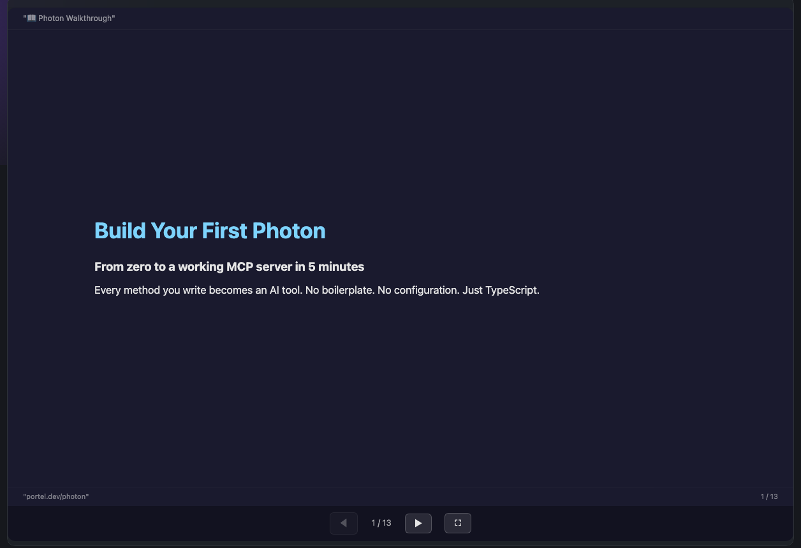

# Build Your First Photon

### From zero to a working MCP server in 5 minutes

Every method you write becomes an AI tool.
No boilerplate. No configuration. Just TypeScript.

---

# What is a Photon?

A **single `.photon.ts` file** that becomes a full MCP server.

```typescript
// hello.photon.ts
export default class Hello {
  greet({ name }: { name: string }) {
    return `Hello, ${name}!`;
  }
}
```

That's it. This is a complete, working photon.

**Every public method → an MCP tool.**

---

# Run It

### Three ways to use your photon:

| Command | What it does |
|---------|-------------|
| `photon beam` | Opens the web UI (Beam) |
| `photon cli hello greet --name World` | Runs from terminal |
| `photon mcp hello` | Starts as MCP server for Claude/Cursor |

All three produce the same result: `"Hello, World!"`

---

# This Walkthrough Is a Photon Too

<div style="display:grid;grid-template-columns:0.92fr 1.08fr;gap:28px;align-items:center;">
  <div>
    <p style="font-size:1.1em;opacity:0.86;margin:0 0 0.9em;">
      The walkthrough itself is just a photon with a <code>main()</code> method.
      Beam launches it as an app automatically.
    </p>
    <pre style="margin:0;background:rgba(0,0,0,0.28);padding:18px;border-radius:14px;overflow:auto;"><code class="language-typescript">/**
 * @format slides
 */
main() {
  return this.assets('slides.md', true)
}</code></pre>
    <p style="font-size:0.95em;opacity:0.72;margin:1em 0 0;">
      Markdown + assets folder = a full in-product walkthrough.
    </p>
  </div>
  <div>
    
  </div>
</div>

---

<!-- transition: slide -->

# Step 1: Parameters

<div style="display:grid;grid-template-columns:1fr 1fr;gap:24px;align-items:start;">
  <div>
    <p style="margin:0 0 12px;">Methods receive typed parameters. The runtime auto-generates forms.</p>
    <pre style="background:rgba(0,0,0,0.28);padding:16px;border-radius:12px;overflow:auto;font-size:0.85em;"><code class="language-typescript">export default class Calculator {
  /**
   * Add two numbers
   * @param a First number
   * @param b Second number
   */
  add({ a, b }: { a: number; b: number }) {
    return { result: a + b };
  }
}</code></pre>
    <ul style="font-size:0.9em;margin:10px 0 0;padding-left:1.2em;">
      <li>TypeScript types → JSON Schema → auto UI form</li>
      <li><code>@param</code> descriptions become field labels</li>
    </ul>
  </div>
  <div>
    <p style="font-size:0.85em;opacity:0.7;margin:0 0 8px;">Live — Beam auto-generates this form:</p>
    <div data-embed="math/calculate" data-embed-height="300"></div>
  </div>
</div>

---

# Beam Generates the UI and CLI

<div style="display:grid;grid-template-columns:0.96fr 1.04fr;gap:28px;align-items:start;">
  <div>
    <p style="font-size:1.08em;opacity:0.86;margin:0 0 0.9em;">
      Once your method has typed params, Beam gives you:
    </p>
    <ul style="font-size:1.02em;line-height:1.65;margin:0 0 1.2em 1.1em;">
      <li>a form with the right input widgets</li>
      <li>a live CLI command you can copy</li>
      <li>the same tool callable from Beam, CLI, and MCP</li>
    </ul>
    
  </div>
  <div>
    
  </div>
</div>

---

<!-- transition: cover -->

# Step 2: Output Formats

<div style="display:grid;grid-template-columns:1fr 1fr;gap:24px;align-items:start;">
  <div>
    <p style="margin:0 0 12px;">Tell the UI how to render results with <code>@format</code>.</p>
    <pre style="background:rgba(0,0,0,0.28);padding:16px;border-radius:12px;overflow:auto;font-size:0.82em;"><code class="language-typescript">export default class Dashboard {
  /** @format table */
  users() {
    return [
      { name: "Alice", role: "Admin" },
      { name: "Bob", role: "Editor" },
    ];
  }

  /** @format gauge */
  cpu() {
    return { value: 73, max: 100,
             label: "CPU", unit: "%" };
  }
}</code></pre>
  </div>
  <div>
    <p style="font-size:0.85em;opacity:0.7;margin:0 0 8px;">Live — table and gauge rendering:</p>
    <div data-embed="render-showcase/table" data-embed-height="180"></div>
    <div data-embed="render-showcase/gauge" data-embed-height="150" style="margin-top:12px;"></div>
  </div>
</div>

---

# 48 Output Formats

| Category | Formats |
|----------|---------|
| **Data** | table, list, card, kv, tree, grid |
| **Charts** | chart:bar, chart:line, chart:pie, chart:area, chart:donut |
| **Metrics** | metric, gauge, progress, badge, stat-group |
| **Content** | markdown, code, json, mermaid, diff, log |
| **Visuals** | timeline, calendar, map, heatmap, network, qr |
| **Layout** | steps, kanban, comparison, invoice, feature-grid |
| **Media** | image, embed, slides |

If you don't specify `@format`, it auto-detects from data shape.

---

# Step 3: Input Formats

<div style="display:grid;grid-template-columns:1fr 1fr;gap:24px;align-items:start;">
  <div>
    <p style="margin:0 0 12px;">Control how form fields render with <code>{@format}</code> on params.</p>
    <pre style="background:rgba(0,0,0,0.28);padding:16px;border-radius:12px;overflow:auto;font-size:0.82em;"><code class="language-typescript">/**
 * @param email Email {@format email}
 * @param password Secret {@format password}
 * @param birthday Date {@format date}
 * @param role Role {@format segmented}
 * @param tags Interests {@format tags}
 */
register({ email, password,
           birthday, role, tags }: {
  email: string;
  password: string;
  birthday: string;
  role: "admin" | "editor" | "viewer";
  tags: string[];
}) { ... }</code></pre>
  </div>
  <div>
    <p style="font-size:0.85em;opacity:0.7;margin:0 0 8px;">Live — specialized input widgets:</p>
    <div data-embed="input-showcase/register" data-embed-height="340"></div>
  </div>
</div>

---

<!-- transition: slide -->

# Step 4: Stateful Photons

<div style="display:grid;grid-template-columns:1fr 1fr;gap:24px;align-items:start;">
  <div>
    <p style="margin:0 0 12px;">Add <code>@stateful</code> to persist data between calls.</p>
    <pre style="background:rgba(0,0,0,0.28);padding:16px;border-radius:12px;overflow:auto;font-size:0.82em;"><code class="language-typescript">/**
 * @stateful
 */
export default class TodoList {
  private items: string[] = [];

  add({ text }: { text: string }) {
    this.items.push(text);
    return { added: text,
             total: this.items.length };
  }

  /** @format list */
  list() {
    return this.items.map(text => ({
      name: text, status: "pending"
    }));
  }
}</code></pre>
  </div>
  <div>
    <p style="font-size:0.85em;opacity:0.7;margin:0 0 8px;">State persists to <code>~/.photon/state/</code></p>
    <div data-embed="todo/add" data-embed-height="180"></div>
    <div data-embed="todo/list" data-embed-height="180" style="margin-top:12px;"></div>
  </div>
</div>

---

# Step 5: Real-time Updates

<div style="display:grid;grid-template-columns:1fr 1fr;gap:24px;align-items:start;">
  <div>
    <p style="margin:0 0 12px;">Generator methods stream results in real-time.</p>
    <pre style="background:rgba(0,0,0,0.28);padding:16px;border-radius:12px;overflow:auto;font-size:0.82em;"><code class="language-typescript">export default class Monitor {
  /** @format gauge */
  async *cpu() {
    for (let i = 0; i < 10; i++) {
      const value = Math.round(
        30 + Math.random() * 50);
      yield { emit: "render",
              format: "gauge",
              value: { value, max: 100,
                       label: "CPU" } };
      await new Promise(r =>
        setTimeout(r, 1000));
    }
    return { value: 42, max: 100,
             label: "CPU", unit: "%" };
  }
}</code></pre>
  </div>
  <div>
    <p style="font-size:0.85em;opacity:0.7;margin:0 0 8px;"><code>yield { emit: "render" }</code> updates the UI live.</p>
    <div data-embed="render-showcase/gauge" data-embed-height="300"></div>
  </div>
</div>

---

<!-- transition: reveal -->

# Step 6: Custom UI

<div style="display:grid;grid-template-columns:1fr 1fr;gap:24px;align-items:start;">
  <div>
    <p style="margin:0 0 12px;">For full control, create a <code>.photon.html</code> template.</p>
    <pre style="background:rgba(0,0,0,0.28);padding:16px;border-radius:12px;overflow:auto;font-size:0.85em;"><code class="language-html">&lt;!-- dashboard.photon.html --&gt;
&lt;h1&gt;My Dashboard&lt;/h1&gt;
&lt;div data-method="cpu"&gt;&lt;/div&gt;
&lt;div data-method="memory"&gt;&lt;/div&gt;
&lt;button data-method="restart"
        data-target="#status"&gt;
  Restart
&lt;/button&gt;
&lt;span id="status"&gt;&lt;/span&gt;</code></pre>
    <p style="font-size:0.9em;margin:10px 0 0;">Just <code>data-method</code> — format, live updates, theme all auto-inferred.</p>
  </div>
  <div>
    <p style="font-size:0.85em;opacity:0.7;margin:0 0 8px;">Live — the same bindings work in slides too:</p>
    <div class="demo-box" style="background:rgba(128,128,128,0.1);border:1px solid rgba(128,128,128,0.2);border-radius:8px;padding:16px;margin:0;">
      <button data-method="walkthrough/greet"
              data-args='{"name":"Photon User"}'
              data-target="#greet-result"
              style="padding:8px 20px;border-radius:6px;background:rgba(125,211,252,0.2);border:1px solid rgba(125,211,252,0.4);color:inherit;cursor:pointer;font-size:1em;">
        Say Hello
      </button>
      <div id="greet-result" style="margin-top:12px;font-size:1.3em;min-height:1.5em;"></div>
    </div>
  </div>
</div>

---

# Step 7: Deploy Everywhere

Your photon works on every MCP client — zero changes needed.

| Client | Command |
|--------|---------|
| **Beam** (web UI) | `photon beam` |
| **Claude Desktop** | `photon mcp my-app --config` |
| **Cursor** | Same MCP config |
| **CLI** | `photon cli my-app method --param value` |
| **Standalone binary** | `photon build my-app` |

### One file. Every platform.

---

<!-- transition: zoom -->

# Interactive Slides

These slides use two features you can add to any presentation photon:

| Feature | How |
|---------|-----|
| **Live embeds** | `data-embed="photon/method"` renders Beam UI in an iframe |
| **MCP calls** | `data-method="photon/method"` makes live tool calls |
| **Transitions** | `transition: fade` in frontmatter or `<!-- transition: slide -->` per-slide |

Every code example had a **live Beam panel** next to it — not a screenshot.

---

# What's Next?

### Explore the examples:
- `render-showcase.photon.ts` — all 48 output formats
- `input-showcase.photon.ts` — all input widgets
- `pizzaz-shop.photon.ts` — real-world e-commerce

### Resources:
- **Docs**: `docs/reference/DOCBLOCK-TAGS.md`
- **Marketplace**: `photon search <keyword>`
- **Create**: `photon maker new`

### The philosophy:
> Every method is a tool. Every file is a server.
> No boilerplate. No configuration. Just build.
