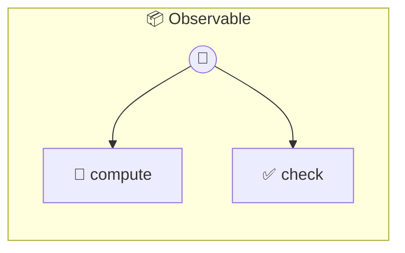

# Observable

Observable Computation Service Demonstrates OpenTelemetry GenAI instrumentation. When @opentelemetry/api is installed, all tool calls produce gen_ai.tool.call spans with standardized attributes. Without the package, everything works with zero overhead.

> **2 tools** · API Photon · v1.0.0 · MIT


## ⚙️ Configuration

No configuration required.


## 🔧 Tools


### `compute`

Compute a math expression with OTel tracing. Creates a gen_ai.tool.call span wrapping the computation. The span includes attributes for tool name, agent name, and operation name following CNCF GenAI conventions.


| Parameter | Type | Required | Description |
|-----------|------|----------|-------------|
| `expression` | string | Yes | Math expression to evaluate (e.g., "2 + 2") |


---


### `check`

Check tracing status. Returns whether OpenTelemetry is available and active. Useful for diagnostics and health checks.


---


## 🏗️ Architecture




## 📥 Usage

```bash
# Install from marketplace
photon add observable

# Get MCP config for your client
photon info observable --mcp
```

## 📦 Dependencies

No external dependencies.

---

MIT · v1.0.0
