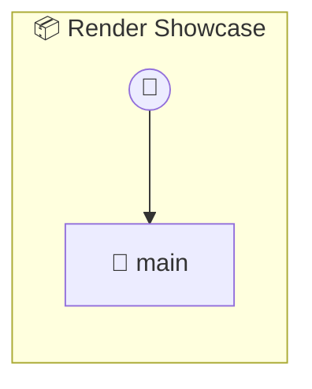

# Render Showcase

Render Showcase Demonstrates photon.render() — how custom UIs can use auto UI format renderers (table, gauge, chart, etc.) without building everything from scratch. Each method returns sample data in a shape that a specific format renderer understands. The custom UI dashboard calls photon.render(container, data, format) to visualize them.

> **1 tools** · API Photon · v1.0.0 · MIT

**Platform Features:** `custom-ui` `dashboard`

## ⚙️ Configuration

No configuration required.


## 🔧 Tools


### `main`

Open the render showcase dashboard


---


## 🏗️ Architecture




## 📥 Usage

```bash
# Install from marketplace
photon add render-showcase

# Get MCP config for your client
photon info render-showcase --mcp
```

## 📦 Dependencies

No external dependencies.

---

MIT · v1.0.0
