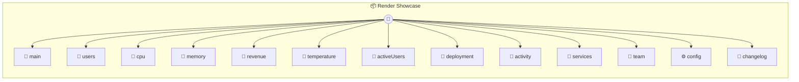

# Render Showcase

Render Showcase Demonstrates photon.render() — how custom UIs can use auto UI format renderers (table, gauge, chart, etc.) without building everything from scratch. Each method returns sample data in a shape that a specific format renderer understands. The custom UI dashboard calls photon.render(container, data, format) to visualize them.

> **13 tools** · API Photon · v1.0.0 · MIT

**Platform Features:** `custom-ui` `dashboard`

## ⚙️ Configuration

No configuration required.


## 📋 Quick Reference

| Method | Description |
|--------|-------------|
| `main` | Open the render showcase dashboard |
| `users` | Sample user data for table rendering |
| `cpu` | CPU usage for gauge rendering |
| `memory` | Memory usage for gauge rendering |
| `revenue` | Monthly revenue for chart rendering |
| `temperature` | Temperature trend for line chart |
| `activeUsers` | Key business metric |
| `deployment` | Deployment progress |
| `activity` | Recent activity timeline |
| `services` | Service status badges |
| `team` | Team members list |
| `config` | System configuration key-value pairs |
| `changelog` | Release notes in markdown |


## 🔧 Tools


### `main`

Open the render showcase dashboard


---


### `users`

Sample user data for table rendering


---


### `cpu`

CPU usage for gauge rendering


---


### `memory`

Memory usage for gauge rendering


---


### `revenue`

Monthly revenue for chart rendering


---


### `temperature`

Temperature trend for line chart


---


### `activeUsers`

Key business metric


---


### `deployment`

Deployment progress


---


### `activity`

Recent activity timeline


---


### `services`

Service status badges


---


### `team`

Team members list


---


### `config`

System configuration key-value pairs


---


### `changelog`

Release notes in markdown


---


## 🏗️ Architecture




## 📥 Usage

```bash
# Install from marketplace
photon add render-showcase

# Get MCP config for your client
photon info render-showcase --mcp
```

## 📦 Dependencies

No external dependencies.

---

MIT · v1.0.0
