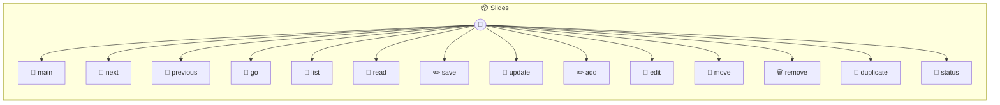

# Slides

Slides — AI-Native Presentation Tool Each instance is a deck: `_use('quarterly-review')` → `quarterly-review.md`. Pass a full path to open any markdown file: `_use('/path/to/deck.md')`.

> **14 tools** · API Photon · v1.0.0 · MIT

**Platform Features:** `custom-ui` `stateful` `dashboard`

## ⚙️ Configuration

No configuration required.


## 📋 Quick Reference

| Method | Description |
|--------|-------------|
| `main` | Open the presentation UI |
| `next` | Move to the next slide |
| `previous` | Move to the previous slide |
| `go` | Jump to a specific slide |
| `list` | List saved decks in the slides folder |
| `read` | Read the current deck's markdown |
| `save` | Save markdown to the current deck |
| `update` | Update the full markdown and re-render |
| `add` | Insert a new slide at a position |
| `edit` | Replace a slide's content |
| `move` | Reorder a slide |
| `remove` | Delete a slide |
| `duplicate` | Duplicate a slide |
| `status` | Current presentation state for AI context |


## 🔧 Tools


### `main`

Open the presentation UI


---


### `next`

Move to the next slide


---


### `previous`

Move to the previous slide


---


### `go`

Jump to a specific slide


| Parameter | Type | Required | Description |
|-----------|------|----------|-------------|
| `index` | any | Yes | 0-based slide index |


---


### `list`

List saved decks in the slides folder


---


### `read`

Read the current deck's markdown


---


### `save`

Save markdown to the current deck


| Parameter | Type | Required | Description |
|-----------|------|----------|-------------|
| `markdown` | any | Yes | Full Marp markdown content |


---


### `update`

Update the full markdown and re-render


| Parameter | Type | Required | Description |
|-----------|------|----------|-------------|
| `markdown` | any | Yes | New Marp markdown content |


---


### `add`

Insert a new slide at a position


| Parameter | Type | Required | Description |
|-----------|------|----------|-------------|
| `markdown` | any | Yes | Slide content |
| `index` | number } | No | Position to insert (appends if omitted) |


---


### `edit`

Replace a slide's content


| Parameter | Type | Required | Description |
|-----------|------|----------|-------------|
| `index` | any | Yes | Slide index |
| `markdown` | string } | Yes | New content |


---


### `move`

Reorder a slide


| Parameter | Type | Required | Description |
|-----------|------|----------|-------------|
| `from` | any | Yes | Source index |
| `to` | number } | Yes | Target index |


---


### `remove`

Delete a slide


| Parameter | Type | Required | Description |
|-----------|------|----------|-------------|
| `index` | any | Yes | Slide index |


---


### `duplicate`

Duplicate a slide


| Parameter | Type | Required | Description |
|-----------|------|----------|-------------|
| `index` | any | Yes | Slide index to copy |


---


### `status`

Current presentation state for AI context


---


## 🏗️ Architecture




## 📥 Usage

```bash
# Install from marketplace
photon add slides

# Get MCP config for your client
photon info slides --mcp
```

## 📦 Dependencies


```
@marp-team/marp-core@^4.3.0
```

---

MIT · v1.0.0
