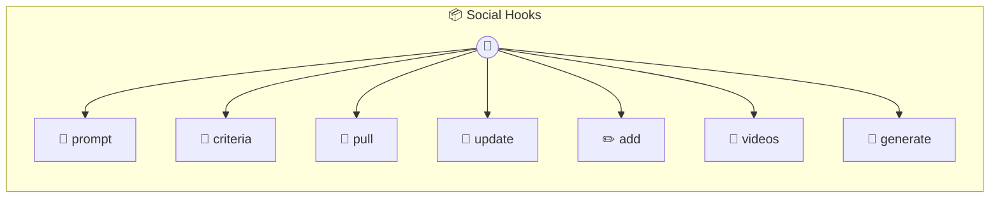

# Social Hooks

Social Hooks — AutoResearch target for video/social media hooks Implements the AutoResearch interface so autorun can optimize your video hooks based on real view counts. Stores the prompt template as a markdown file and pulls metrics from a CSV log. Feed your view counts into the CSV and let the loop optimize which hook patterns get the most views.

> **7 tools** · API Photon · v1.0.0 · MIT

**Platform Features:** `stateful`

## ⚙️ Configuration

No configuration required.


## 📋 Quick Reference

| Method | Description |
|--------|-------------|
| `prompt` | Returns the current hook prompt template |
| `criteria` | Binary eval criteria for hook quality — no vibes, only yes/no |
| `pull` | Pull performance data from the metrics CSV |
| `update` | Write an improved prompt template |
| `add` | Add a video and its view count to the metrics log |
| `videos` | View all tracked videos and their metrics |
| `generate` | Generate a hook using the current prompt template. |


## 🔧 Tools


### `prompt`

Returns the current hook prompt template


---


### `criteria`

Binary eval criteria for hook quality — no vibes, only yes/no


---


### `pull`

Pull performance data from the metrics CSV


---


### `update`

Write an improved prompt template


---


### `add`

Add a video and its view count to the metrics log


| Parameter | Type | Required | Description |
|-----------|------|----------|-------------|
| `id` | any | Yes | Unique video identifier (e.g. `v42`) |
| `content` | string | Yes | The hook text used |
| `views` | number } | Yes | View count |


---


### `videos`

View all tracked videos and their metrics


---


### `generate`

Generate a hook using the current prompt template. Returns the prompt so the calling LLM can generate the hook.


| Parameter | Type | Required | Description |
|-----------|------|----------|-------------|
| `topic` | any | Yes | What the video is about (e.g. `AI automating content creation`) |


---


## 🏗️ Architecture




## 📥 Usage

```bash
# Install from marketplace
photon add social-hooks

# Get MCP config for your client
photon info social-hooks --mcp
```

## 📦 Dependencies

No external dependencies.

---

MIT · v1.0.0
