# Spreadsheet

Spreadsheet — CSV-backed spreadsheet with formulas A spreadsheet engine that works on plain CSV files. Formulas (=SUM, =AVG, etc.) are stored directly in CSV cells and evaluated at runtime. Named instances map to CSV files: `_use('budget')` → `budget.csv` in your spreadsheets folder. Pass a full path to open any CSV: `_use('/path/to/data.csv')`.

> **37 tools** · API Photon · v1.1.0 · MIT

**Platform Features:** `custom-ui` `stateful` `dashboard`

## ⚙️ Configuration

No configuration required.


## 📋 Quick Reference

| Method | Description |
|--------|-------------|
| `main` | Open spreadsheet UI |
| `list_tables` | List all tables (CSV files) in the spreadsheets folder |
| `list_records` | View records (Airtable-compatible) |
| `lookup` | Lookup a value from another table. |
| `get_record` | Get a single record by its row number |
| `create_record` | Create a new record (Airtable-compatible) |
| `update_record` | Update an existing record (Airtable-compatible) |
| `delete_record` | Delete a record (Airtable-compatible) |
| `search_records` | Search for records (Airtable-compatible) |
| `view` | View the spreadsheet grid. |
| `get` | Get a cell value. |
| `set` | Set a cell value or formula. |
| `add` | Add a row of data. |
| `remove` | Remove a row |
| `removeColumn` | Remove a column |
| `insertRow` | Insert a row at a specific position |
| `insertColumn` | Insert a column at a specific position |
| `upsert` | Update or insert a row (Database Upsert). |
| `search` | Fuzzy search across columns. |
| `update` | Update fields in a row |
| `query` | Query rows by condition. |
| `sort` | Sort by column. |
| `fill` | Fill a range with values or a pattern |
| `schema` | Show column headers and detected types |
| `resize` | Resize the spreadsheet grid |
| `ingest` | Import CSV data. |
| `dump` | Export as CSV. |
| `clear` | Clear cells. |
| `rename` | Rename a column header |
| `format` | Set column formatting. |
| `tail` | Watch the CSV file for appended rows. |
| `untail` | Stop watching the CSV file. |
| `push` | Append rows to the spreadsheet. |
| `sql` | Run a SQL query on the spreadsheet data. |
| `watch` | Create a live SQL watch. |
| `unwatch` | Remove a live SQL watch |
| `watches` | List active SQL watches. |


## 🔧 Tools


### `main`

Open spreadsheet UI


---


### `list_tables`

List all tables (CSV files) in the spreadsheets folder


---


### `list_records`

View records (Airtable-compatible)


| Parameter | Type | Required | Description |
|-----------|------|----------|-------------|
| `maxRecords` | number | No | Max records to return (default 100) |
| `offset` | number | No | Row offset for pagination |
| `filterByFormula` | string | No | Optional formula to filter records (e.g. "{Age} > 25") |


---


### `lookup`

Lookup a value from another table. Mimics the relational "Lookup" field in Airtable/Google Sheets.


| Parameter | Type | Required | Description |
|-----------|------|----------|-------------|
| `table` | string | Yes | Other table name (e.g. "Products") |
| `matchField` | string | Yes | Field in the other table to match against (e.g. "SKU") |
| `matchValue` | string | Yes | Value to search for (e.g. "A101") |
| `resultField` | string | Yes | Field to return from the matching row (e.g. "Price") |


---


### `get_record`

Get a single record by its row number


| Parameter | Type | Required | Description |
|-----------|------|----------|-------------|
| `recordId` | number | Yes | Row number (1-indexed) |


---


### `create_record`

Create a new record (Airtable-compatible)


| Parameter | Type | Required | Description |
|-----------|------|----------|-------------|
| `fields` | Record<string | Yes | Key-value pairs for the new record |


---


### `update_record`

Update an existing record (Airtable-compatible)


| Parameter | Type | Required | Description |
|-----------|------|----------|-------------|
| `recordId` | number | Yes | Row number (1-indexed) |
| `fields` | Record<string | Yes | Key-value pairs to update |


---


### `delete_record`

Delete a record (Airtable-compatible)


| Parameter | Type | Required | Description |
|-----------|------|----------|-------------|
| `recordId` | number | Yes | Row number (1-indexed) |


---


### `search_records`

Search for records (Airtable-compatible)


| Parameter | Type | Required | Description |
|-----------|------|----------|-------------|
| `query` | string | Yes | Text to search for |


---


### `view`

View the spreadsheet grid. Returns the full spreadsheet or a specific range as a formatted table.


| Parameter | Type | Required | Description |
|-----------|------|----------|-------------|
| `range` | any | Yes | Optional cell range to view (e.g., "A1:D10") |
| `offset` | number | No | Row offset for pagination |
| `limit` | number } | No | Max rows to return (defaults to settings.pageSize) |


---


### `get`

Get a cell value. Returns the evaluated value and raw content (formula if any) for a single cell.


| Parameter | Type | Required | Description |
|-----------|------|----------|-------------|
| `cell` | string | Yes | Cell reference in A1 notation (e.g., "B3") |


---


### `set`

Set a cell value or formula. Set a cell to a plain value or a formula starting with "=". Formulas support: SUM, AVG, MAX, MIN, COUNT, IF, LEN, ABS, ROUND, CONCAT. Cell references use A1 notation. Ranges use A1:B2 notation.


| Parameter | Type | Required | Description |
|-----------|------|----------|-------------|
| `cell` | string | Yes | Cell reference in A1 notation (e.g., "B3") |
| `value` | string | Yes | Value or formula (e.g., "42" or "=SUM(A1:A5)") |


---


### `add`

Add a row of data. Add a new row to the bottom of the spreadsheet. Pass column values by header name.


| Parameter | Type | Required | Description |
|-----------|------|----------|-------------|
| `values` | Record<string | Yes | Key-value pairs mapping column names to values (e.g., {"Name": "Alice", "Age": "30"}) |


---


### `remove`

Remove a row


| Parameter | Type | Required | Description |
|-----------|------|----------|-------------|
| `row` | number | Yes | Row number to remove (1-indexed) |


---


### `removeColumn`

Remove a column


| Parameter | Type | Required | Description |
|-----------|------|----------|-------------|
| `column` | string | Yes | Column letter or header name to remove |


---


### `insertRow`

Insert a row at a specific position


| Parameter | Type | Required | Description |
|-----------|------|----------|-------------|
| `row` | number | Yes | Row number to insert before (1-indexed) |
| `values` | Record<string | No | Optional: Key-value pairs for the new row |


---


### `insertColumn`

Insert a column at a specific position


| Parameter | Type | Required | Description |
|-----------|------|----------|-------------|
| `column` | string | Yes | Column letter or header name to insert before |
| `name` | string | Yes | Name for the new column |


---


### `upsert`

Update or insert a row (Database Upsert). Finds a row matching the `search` criteria. If found, updates it with `values`. If not found, adds a new row with `values`.


| Parameter | Type | Required | Description |
|-----------|------|----------|-------------|
| `search` | Record<string | Yes | Key-value pairs to match an existing row (e.g., {"ID": "123"}) |
| `values` | Record<string | Yes | Key-value pairs to set in the row |


---


### `search`

Fuzzy search across columns. Finds rows containing the query string in any of the specified columns. Uses streaming generator for memory efficiency on large files.


| Parameter | Type | Required | Description |
|-----------|------|----------|-------------|
| `query` | string | Yes | Search string |
| `columns` | string[] | No | Optional: array of column names to search (searches all if omitted) |
| `limit` | number | No | Max results to return |


---


### `update`

Update fields in a row


| Parameter | Type | Required | Description |
|-----------|------|----------|-------------|
| `row` | number | Yes | Row number to update (1-indexed) |
| `values` | Record<string | Yes | Key-value pairs mapping column names to new values |


---


### `query`

Query rows by condition. Filter rows where a column matches a condition. Supports: =, !=, >, <, >=, <=, contains.


| Parameter | Type | Required | Description |
|-----------|------|----------|-------------|
| `where` | string | Yes | Condition string (e.g., "Age > 25", "Name contains Ali") |
| `limit` | number | No | Max rows to return |


---


### `sort`

Sort by column. Sorts all data rows by the specified column.


| Parameter | Type | Required | Description |
|-----------|------|----------|-------------|
| `column` | string | Yes | Column name or letter to sort by |
| `order` | string | No | Sort order: "asc" or "desc" |


---


### `fill`

Fill a range with values or a pattern


| Parameter | Type | Required | Description |
|-----------|------|----------|-------------|
| `range` | string | Yes | Cell range (e.g., "A1:A10") |
| `pattern` | string | Yes | Comma-separated values to repeat (e.g., "1,2,3") |


---


### `schema`

Show column headers and detected types


---


### `resize`

Resize the spreadsheet grid


| Parameter | Type | Required | Description |
|-----------|------|----------|-------------|
| `rows` | number | No | New number of rows |
| `cols` | number | No | New number of columns |


---


### `ingest`

Import CSV data. Load data from a CSV file path or raw CSV text. The first row is treated as headers.


| Parameter | Type | Required | Description |
|-----------|------|----------|-------------|
| `file` | string | No | Path to a CSV file to import |
| `csv` | string | No | Raw CSV text to import (alternative to file) |


---


### `dump`

Export as CSV. Returns the raw CSV content (with formulas preserved), or saves to a file.


| Parameter | Type | Required | Description |
|-----------|------|----------|-------------|
| `file` | any | Yes | Optional file path to save CSV to |


---


### `clear`

Clear cells. Clear all cells or a specific range.


| Parameter | Type | Required | Description |
|-----------|------|----------|-------------|
| `range` | any | Yes | Optional range to clear (e.g., "B:B" or "A1:C5"). Clears all if omitted. |


---


### `rename`

Rename a column header


| Parameter | Type | Required | Description |
|-----------|------|----------|-------------|
| `column` | string | Yes | Column letter or current header name |
| `name` | string | Yes | New header name |


---


### `format`

Set column formatting. Set alignment, type, or width for a column. This creates a format row in the CSV when formatting is set to "auto" (default).


| Parameter | Type | Required | Description |
|-----------|------|----------|-------------|
| `column` | string | Yes | Column letter or header name |
| `align` | string | No | Alignment: "left", "right", or "center" |
| `type` | string | No | Column type: "text", "number", "currency", "percent", "date", "bool", "select", "formula", "markdown", "longtext" |
| `width` | number | No | Column width in pixels |
| `wrap` | boolean | No | Enable text wrapping for this column |


**Example:**

```typescript
format({ column: 'B', align: 'right', type: 'number' })
```


---


### `tail`

Watch the CSV file for appended rows. Starts watching the underlying CSV file. When external processes append rows, the spreadsheet updates in real-time. Use `unwatch` to stop.


---


### `untail`

Stop watching the CSV file. Stops the file watcher started by `tail`.


---


### `push`

Append rows to the spreadsheet. Batch-append one or more rows. Each row is a list of values matching the column order, or a key-value object mapping column names to values. Emits after all rows are added so charts and UIs update once.


| Parameter | Type | Required | Description |
|-----------|------|----------|-------------|
| `rows` | any | Yes | Array of rows to append. Each row is either an array of values or a {column: value} object. |


**Example:**

```typescript
push({ rows: [["Alice", "30"], ["Bob", "25"]] })
```


---


### `sql`

Run a SQL query on the spreadsheet data. Query the spreadsheet using SQL syntax. Table name is `data`. Column names with spaces or special characters need double quotes.


| Parameter | Type | Required | Description |
|-----------|------|----------|-------------|
| `query` | string | Yes | SQL query string (e.g., "SELECT * FROM data WHERE Age > 25") |


**Example:**

```typescript
sql({ query: "SELECT Name, Age FROM data WHERE Age > 25 ORDER BY Age DESC" })
```


---


### `watch`

Create a live SQL watch. Registers a named SQL query that re-runs after every data change. When the query returns rows, an alert is emitted. Optionally triggers a cross-photon action (e.g., "slack.send").


| Parameter | Type | Required | Description |
|-----------|------|----------|-------------|
| `name` | string | Yes | Unique watch name (e.g., "price-alert") |
| `query` | string | Yes | SQL query — fires when it returns rows (e.g., "SELECT * FROM data WHERE Price < 50") |
| `action` | string | No | Optional cross-photon call target (e.g., "slack.send") |
| `actionParams` | Record<string | No | Optional parameters passed to the action |
| `once` | boolean | No | If true, auto-removes after first trigger |


**Example:**

```typescript
watch({ name: "big-orders", query: "SELECT * FROM data WHERE Amount > 1000" })
```


---


### `unwatch`

Remove a live SQL watch


| Parameter | Type | Required | Description |
|-----------|------|----------|-------------|
| `name` | string | Yes | Watch name to remove |


---


### `watches`

List active SQL watches. Shows all registered watches with their trigger counts and status.


---


## 🏗️ Architecture

```mermaid
flowchart LR
    subgraph spreadsheet["📦 Spreadsheet"]
        direction TB
        PHOTON((🎯))
        T0[🔧 main]
        PHOTON --> T0
        T1[📖 list_tables]
        PHOTON --> T1
        T2[📖 list_records]
        PHOTON --> T2
        T3[🔧 lookup]
        PHOTON --> T3
        T4[📖 get_record]
        PHOTON --> T4
        T5[✏️ create_record]
        PHOTON --> T5
        T6[🔄 update_record]
        PHOTON --> T6
        T7[🗑️ delete_record]
        PHOTON --> T7
        T8[📖 search_records]
        PHOTON --> T8
        T9[🔧 view]
        PHOTON --> T9
        T10[📖 get]
        PHOTON --> T10
        T11[✏️ set]
        PHOTON --> T11
        T12[✏️ add]
        PHOTON --> T12
        T13[🗑️ remove]
        PHOTON --> T13
        T14[🗑️ removeColumn]
        PHOTON --> T14
        T15[✏️ insertRow]
        PHOTON --> T15
        T16[✏️ insertColumn]
        PHOTON --> T16
        T17[🔧 upsert]
        PHOTON --> T17
        T18[📖 search]
        PHOTON --> T18
        T19[🔄 update]
        PHOTON --> T19
        T20[📖 query]
        PHOTON --> T20
        T21[🔧 sort]
        PHOTON --> T21
        T22[🔧 fill]
        PHOTON --> T22
        T23[🔧 schema]
        PHOTON --> T23
        T24[🔧 resize]
        PHOTON --> T24
        T25[🔧 ingest]
        PHOTON --> T25
        T26[🔧 dump]
        PHOTON --> T26
        T27[🗑️ clear]
        PHOTON --> T27
        T28[🔧 rename]
        PHOTON --> T28
        T29[🔧 format]
        PHOTON --> T29
        T30[🔧 tail]
        PHOTON --> T30
        T31[🔧 untail]
        PHOTON --> T31
        T32[📤 push]
        PHOTON --> T32
        T33[🔧 sql]
        PHOTON --> T33
        T34[🔧 watch]
        PHOTON --> T34
        T35[🔧 unwatch]
        PHOTON --> T35
        T36[🔧 watches]
        PHOTON --> T36
    end

    subgraph deps["Dependencies"]
        direction TB
        NPM0[📚 alasql]
    end
```




## 📥 Usage

```bash
# Install from marketplace
photon add spreadsheet

# Get MCP config for your client
photon info spreadsheet --mcp
```

## 📦 Dependencies


```
@portel/csv@^1.0.0, alasql@^4.0.0
```

---

MIT · v1.1.0
