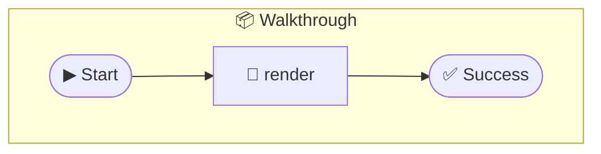

# Walkthrough

Photon Walkthrough An interactive step-by-step guide to building photons. Every demo is a real method on this photon — zero external dependencies. The slides show code for named classes, but the live UI calls these methods.

> **1 tools** · Workflow Photon · v2.0.0 · MIT

**Platform Features:** `generator` `streaming`

## ⚙️ Configuration

No configuration required.


## 🔧 Tools


### `monitor` ⚡

Live CPU monitor — streams gauge updates every second


---


## 🏗️ Architecture




## 📥 Usage

```bash
# Install from marketplace
photon add walkthrough

# Get MCP config for your client
photon info walkthrough --mcp
```

## 📦 Dependencies

No external dependencies.

---

MIT · v2.0.0
