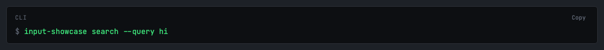
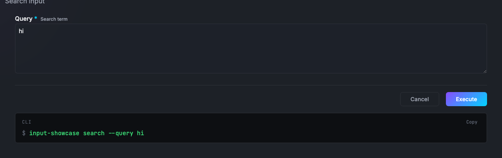

# Build Your First Photon

### From zero to a working MCP server in 5 minutes

Every method you write becomes an AI tool.
No boilerplate. No configuration. Just TypeScript.

---

# What is a Photon?

A **single `.photon.ts` file** that becomes a full MCP server.

```typescript
// hello.photon.ts
export default class Hello {
  greet({ name }: { name: string }) {
    return `Hello, ${name}!`;
  }
}
```

That's it. This is a complete, working photon.

**Every public method → an MCP tool.**

---

# Run It

### Three ways to use your photon:

| Command | What it does |
|---------|-------------|
| `photon beam` | Opens the web UI (Beam) |
| `photon cli hello greet --name World` | Runs from terminal |
| `photon mcp hello` | Starts as MCP server for Claude/Cursor |

All three produce the same result: `"Hello, World!"`

---

# This Walkthrough Is a Photon

<div style="display:grid;grid-template-columns:1fr 1fr;gap:28px;align-items:center;">
  <div>
    <p style="font-size:1.05em;opacity:0.86;margin:0 0 0.9em;">
      You're looking at a photon right now. The <code>main()</code> method
      returns these slides, and Beam renders them as a presentation.
    </p>
    <pre style="margin:0;background:rgba(0,0,0,0.28);padding:18px;border-radius:14px;overflow:auto;"><code class="language-typescript">/**
 * @format slides
 */
main() {
  return this.assets('slides.md', true)
}</code></pre>
    <p style="font-size:0.92em;opacity:0.72;margin:1em 0 0;">
      Every live demo on the following slides calls a method
      on <em>this same photon</em>.
    </p>
  </div>
  <div>
    
  </div>
</div>

---

<!-- transition: slide -->

# Step 1: A Method Returns Data

<div style="display:grid;grid-template-columns:1fr 1fr;gap:24px;align-items:start;">
  <div>
    <p style="margin:0 0 12px;">Write a method. It becomes a tool. The return value is the result.</p>
    <pre style="background:rgba(0,0,0,0.28);padding:16px;border-radius:12px;overflow:auto;font-size:0.85em;"><code class="language-typescript">export default class Hello {
  /**
   * Say hello
   * @param name Who to greet
   */
  greet({ name }: { name: string }) {
    return `Hello, ${name}!`;
  }
}</code></pre>
    <ul style="font-size:0.88em;margin:10px 0 0;padding-left:1.2em;">
      <li>Public method → MCP tool</li>
      <li>Parameter types → auto-generated form</li>
      <li>Return value → displayed to user</li>
    </ul>
  </div>
  <div>
    <p style="font-size:0.85em;opacity:0.7;margin:0 0 8px;">Live — try it:</p>
    <div data-embed="walkthrough/greet" data-embed-height="260"></div>
  </div>
</div>

---

# Step 2: Typed Parameters

<div style="display:grid;grid-template-columns:1fr 1fr;gap:24px;align-items:start;">
  <div>
    <p style="margin:0 0 12px;">TypeScript types become JSON Schema. The runtime auto-generates the right form widgets.</p>
    <pre style="background:rgba(0,0,0,0.28);padding:16px;border-radius:12px;overflow:auto;font-size:0.85em;"><code class="language-typescript">export default class Calculator {
  /**
   * Add two numbers
   * @param a First number
   * @param b Second number
   */
  add({ a, b }: { a: number; b: number }) {
    return {
      result: a + b,
      expression: `${a} + ${b} = ${a + b}`
    };
  }
}</code></pre>
    <ul style="font-size:0.88em;margin:10px 0 0;padding-left:1.2em;">
      <li><code>number</code> → numeric input</li>
      <li><code>string</code> → text field</li>
      <li><code>boolean</code> → toggle switch</li>
      <li><code>@param</code> docs → field labels</li>
    </ul>
  </div>
  <div>
    <p style="font-size:0.85em;opacity:0.7;margin:0 0 8px;">Live — Beam auto-generates this form:</p>
    <div data-embed="walkthrough/add" data-embed-height="300"></div>
  </div>
</div>

---

# Beam Generates the UI and CLI

<div style="display:grid;grid-template-columns:0.96fr 1.04fr;gap:20px;align-items:start;">
  <div>
    <p style="font-size:0.95em;opacity:0.86;margin:0 0 0.7em;">
      Once your method has typed params, Beam gives you:
    </p>
    <ul style="font-size:0.9em;line-height:1.5;margin:0 0 0.8em 1.1em;">
      <li>a form with the right input widgets</li>
      <li>a live CLI command you can copy</li>
      <li>the same tool callable from Beam, CLI, and MCP</li>
    </ul>
    
  </div>
  <div>
    
  </div>
</div>

---

<!-- transition: cover -->

# Step 3: Output Formats

<div style="display:grid;grid-template-columns:1fr 1fr;gap:24px;align-items:start;">
  <div>
    <p style="margin:0 0 12px;">Add <code>@format</code> to control how Beam renders results.</p>
    <pre style="background:rgba(0,0,0,0.28);padding:16px;border-radius:12px;overflow:auto;font-size:0.82em;"><code class="language-typescript">export default class Dashboard {
  /** @format table */
  team() {
    return [
      { name: "Alice", role: "Engineer" },
      { name: "Bob", role: "Designer" },
      { name: "Carol", role: "PM" },
    ];
  }

  /** @format gauge */
  health() {
    return { value: 73, max: 100,
             label: "CPU", unit: "%" };
  }
}</code></pre>
  </div>
  <div>
    <p style="font-size:0.85em;opacity:0.7;margin:0 0 8px;">Live — table and gauge:</p>
    <div data-embed="walkthrough/team" data-embed-height="180"></div>
    <div data-embed="walkthrough/health" data-embed-height="150" style="margin-top:12px;"></div>
  </div>
</div>

---

# Same Data, Different Views

<div style="display:grid;grid-template-columns:1fr 1fr;gap:24px;align-items:start;">
  <div>
    <p style="margin:0 0 12px;">Change <code>@format</code> and the same data renders differently.</p>
    <pre style="background:rgba(0,0,0,0.28);padding:16px;border-radius:12px;overflow:auto;font-size:0.82em;"><code class="language-typescript">/** @format chart:bar */
revenue() {
  return [
    { label: "Q1", value: 42000 },
    { label: "Q2", value: 58000 },
    { label: "Q3", value: 51000 },
    { label: "Q4", value: 67000 },
  ];
}</code></pre>
    <p style="font-size:0.88em;margin:14px 0 0;opacity:0.85;">
      48 built-in formats across 7 categories:
      data, charts, metrics, content, visuals, layout, and media.
    </p>
  </div>
  <div>
    <p style="font-size:0.85em;opacity:0.7;margin:0 0 8px;">Live — bar chart:</p>
    <div data-embed="walkthrough/revenue" data-embed-height="280"></div>
  </div>
</div>

---

# 48 Output Formats

| Category | Formats |
|----------|---------|
| **Data** | table, list, card, kv, tree, grid |
| **Charts** | chart:bar, chart:line, chart:pie, chart:area, chart:donut |
| **Metrics** | metric, gauge, progress, badge, stat-group |
| **Content** | markdown, code, json, mermaid, diff, log |
| **Visuals** | timeline, calendar, map, heatmap, network, qr |
| **Layout** | steps, kanban, comparison, invoice, feature-grid |
| **Media** | image, embed, slides |

If you don't specify `@format`, it auto-detects from data shape.

---

<!-- transition: slide -->

# Step 4: Input Formats

<div style="display:grid;grid-template-columns:1fr 1fr;gap:24px;align-items:start;">
  <div>
    <p style="margin:0 0 12px;">Control how form fields render with <code>{@format}</code> on params.</p>
    <pre style="background:rgba(0,0,0,0.28);padding:16px;border-radius:12px;overflow:auto;font-size:0.82em;"><code class="language-typescript">/**
 * @param email Email {@format email}
 * @param birthday DOB {@format date}
 * @param role Role {@format segmented}
 * @param bio Bio {@format textarea}
 */
register({ email, birthday, role, bio }: {
  email: string;
  birthday: string;
  role: "admin" | "editor" | "viewer";
  bio: string;
}) {
  return { registered: true, email,
           birthday, role };
}</code></pre>
  </div>
  <div>
    <p style="font-size:0.85em;opacity:0.7;margin:0 0 8px;">Live — specialized input widgets:</p>
    <div data-embed="walkthrough/register" data-embed-height="340"></div>
  </div>
</div>

---

# Step 5: Safety Annotations

Methods can declare their side-effect profile with MCP annotations.

```typescript
export default class Database {
  /** @readOnly — safe to auto-approve, no side effects */
  count() { return this.db.count(); }

  /** @destructive — requires user confirmation */
  drop({ table }: { table: string }) { this.db.drop(table); }

  /** @idempotent — safe to retry on failure */
  upsert({ id, data }: { id: string; data: any }) { ... }
}
```

| Annotation | Meaning |
|-----------|---------|
| `@readOnly` | No side effects — clients can auto-approve |
| `@destructive` | Requires explicit confirmation |
| `@idempotent` | Safe to retry without duplication |
| `@openWorld` | Calls external systems |

---

<!-- transition: cover -->

# Step 6: Stateful Photons

<div style="display:grid;grid-template-columns:1fr 1fr;gap:24px;align-items:start;">
  <div>
    <p style="margin:0 0 12px;">Add <code>@stateful</code> to persist data between calls.</p>
    <pre style="background:rgba(0,0,0,0.28);padding:16px;border-radius:12px;overflow:auto;font-size:0.82em;"><code class="language-typescript">/**
 * @stateful
 */
export default class TodoList {
  private items: string[] = [];

  add({ text }: { text: string }) {
    this.items.push(text);
    return { added: text,
             total: this.items.length };
  }

  /** @format list */
  list() {
    return this.items.map(t => ({
      name: t, status: "pending"
    }));
  }
}</code></pre>
  </div>
  <div>
    <ul style="font-size:0.92em;line-height:1.7;padding-left:1.2em;">
      <li>State persists to <code>~/.photon/state/</code></li>
      <li>Auto-emits events on every method call</li>
      <li>Survives restarts — JSON-serialized to disk</li>
      <li>Named instances: <code>_use('work')</code> for separate state</li>
    </ul>
    <pre style="background:rgba(0,0,0,0.28);padding:14px;border-radius:12px;overflow:auto;font-size:0.82em;margin-top:16px;"><code class="language-bash"># Two separate todo lists
photon cli todo add --text "Buy milk" \
  --_use personal
photon cli todo add --text "Ship v2" \
  --_use work</code></pre>
  </div>
</div>

---

# Step 7: Real-time Updates

<div style="display:grid;grid-template-columns:1fr 1fr;gap:24px;align-items:start;">
  <div>
    <p style="margin:0 0 12px;">Generator methods stream results in real-time.</p>
    <pre style="background:rgba(0,0,0,0.28);padding:16px;border-radius:12px;overflow:auto;font-size:0.82em;"><code class="language-typescript">export default class Monitor {
  /** @format gauge */
  async *monitor() {
    for (let i = 0; i < 10; i++) {
      yield {
        emit: "render",
        format: "gauge",
        value: { value: Math.round(
          30 + Math.random() * 50),
          max: 100, label: "CPU" }
      };
      await new Promise(r =>
        setTimeout(r, 1000));
    }
    return { value: 42, max: 100,
             label: "CPU", unit: "%" };
  }
}</code></pre>
  </div>
  <div>
    <p style="font-size:0.85em;opacity:0.7;margin:0 0 8px;">Live — watch it update every second:</p>
    <div data-embed="walkthrough/monitor" data-embed-height="240"></div>
    <ul style="font-size:0.85em;margin:12px 0 0;padding-left:1.2em;">
      <li><code>yield { emit: "render" }</code> replaces the display</li>
      <li><code>this.render(format, value)</code> does the same outside generators</li>
      <li>Works across CLI, Beam, and MCP</li>
    </ul>
  </div>
</div>

---

# Step 8: Intermediate Results

`this.render()` pushes formatted output that replaces the previous display — perfect for progress, dashboards, live data.

```typescript
export default class Deployer {
  async deploy({ env }: { env: string }) {
    this.render('progress', { value: 0, label: 'Starting...' });
    await this.buildAssets();

    this.render('progress', { value: 50, label: 'Deploying...' });
    await this.pushToServer(env);

    this.render('progress', { value: 100, label: 'Done!' });
    return { deployed: true, env, timestamp: new Date().toISOString() };
  }
}
```

The final `return` replaces the last `render()` with the permanent result.

---

<!-- transition: reveal -->

# Step 9: Custom UI

<div style="display:grid;grid-template-columns:1fr 1fr;gap:24px;align-items:start;">
  <div>
    <p style="margin:0 0 12px;">For full control, create a <code>.photon.html</code> template.</p>
    <pre style="background:rgba(0,0,0,0.28);padding:16px;border-radius:12px;overflow:auto;font-size:0.85em;"><code class="language-html">&lt;!-- dashboard.photon.html --&gt;
&lt;h1&gt;My Dashboard&lt;/h1&gt;
&lt;div data-method="health"&gt;&lt;/div&gt;
&lt;div data-method="team"&gt;&lt;/div&gt;
&lt;button data-method="restart"
        data-target="#status"&gt;
  Restart
&lt;/button&gt;
&lt;span id="status"&gt;&lt;/span&gt;</code></pre>
    <p style="font-size:0.88em;margin:10px 0 0;"><code>data-method</code> auto-infers format, renders live results, and respects the active theme.</p>
  </div>
  <div>
    <p style="font-size:0.85em;opacity:0.7;margin:0 0 8px;">Or use the full bridge API in a <code>@ui</code> template:</p>
    <pre style="background:rgba(0,0,0,0.28);padding:14px;border-radius:12px;overflow:auto;font-size:0.82em;"><code class="language-javascript">// window.dashboard is auto-created
window.dashboard.onResult(data => {
  render(data);
});

// Call any method
const team = await
  window.dashboard.callTool(
    'team', {}
  );

// Subscribe to events
window.dashboard.onEvent(event => {
  console.log(event);
});</code></pre>
  </div>
</div>

---

# Step 10: Composability

Photons can use other photons via `@photon` injection.

```typescript
/**
 * @photon weather
 * @photon calendar
 */
export default class Assistant {
  private weather: any;
  private calendar: any;

  async plan({ date }: { date: string }) {
    const [forecast, events] = await Promise.all([
      this.weather.current({ city: 'London' }),
      this.calendar.events({ date }),
    ]);
    return { date, forecast, events };
  }
}
```

Dependencies are resolved automatically — photons discover each other at runtime.

---

# Step 11: User Settings

Expose configurable options that users can change without touching code.

```typescript
export default class Notifier {
  protected settings = {
    /** Check interval in minutes */
    intervalMinutes: 15,
    /** Maximum alerts per hour */
    maxAlerts: 10,
    /** Send desktop notifications */
    desktopNotify: true,
  };

  async check() {
    // this.settings is a read-only Proxy
    const interval = this.settings.intervalMinutes;
    // ...
  }
}
```

Users change settings via `photon cli notifier settings`. Values persist to `~/.photon/state/`.

---

<!-- transition: slide -->

# Step 12: Named Instances

Run multiple copies of the same photon with separate state.

```typescript
/**
 * @stateful
 */
export default class Notes {
  private entries: string[] = [];

  add({ text }: { text: string }) {
    this.entries.push(text);
    return { added: text, total: this.entries.length };
  }
}
```

```bash
# Each instance has its own state
photon cli notes add --text "Buy milk" --_use personal
photon cli notes add --text "Ship v2"  --_use work
photon cli notes list --_use personal   # only personal notes
```

Instance names map to separate state files in `~/.photon/state/notes/`.

---

<!-- transition: zoom -->

# Deploy Everywhere

Your photon works on every MCP client — zero changes needed.

| Client | Command |
|--------|---------|
| **Beam** (web UI) | `photon beam` |
| **Claude Desktop** | `photon mcp my-app --config` |
| **Cursor** | Same MCP config |
| **CLI** | `photon cli my-app method --param value` |
| **Standalone binary** | `photon build my-app` |

### One file. Every platform.

---

# Interactive Slides

These slides use two features you can add to any presentation photon:

| Feature | How |
|---------|-----|
| **Live embeds** | `data-embed="photon/method"` renders Beam UI in an iframe |
| **MCP calls** | `data-method="photon/method"` makes live tool calls |
| **Transitions** | `transition: fade` in frontmatter or `<!-- transition: slide -->` per-slide |

Every code example had a **live Beam panel** next to it — not a screenshot.
All demos called methods on *this very photon*.

---

# What's Next?

### The philosophy:
> Every method is a tool. Every file is a server.
> No boilerplate. No configuration. Just build.

### Create your first photon:
```bash
photon maker new my-app    # scaffold a new photon
photon beam                # open in Beam, start building
```

### Resources:
- **All formats**: `photon cli render-showcase` — see all 48 in action
- **Docs**: `docs/reference/DOCBLOCK-TAGS.md` — every tag explained
- **Marketplace**: `photon search <keyword>` — find community photons
